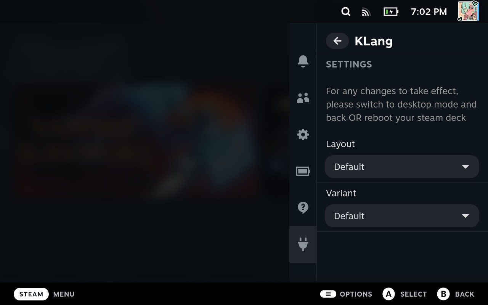
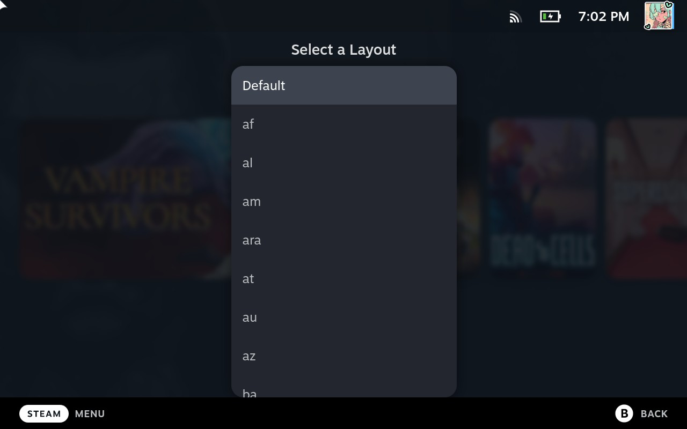
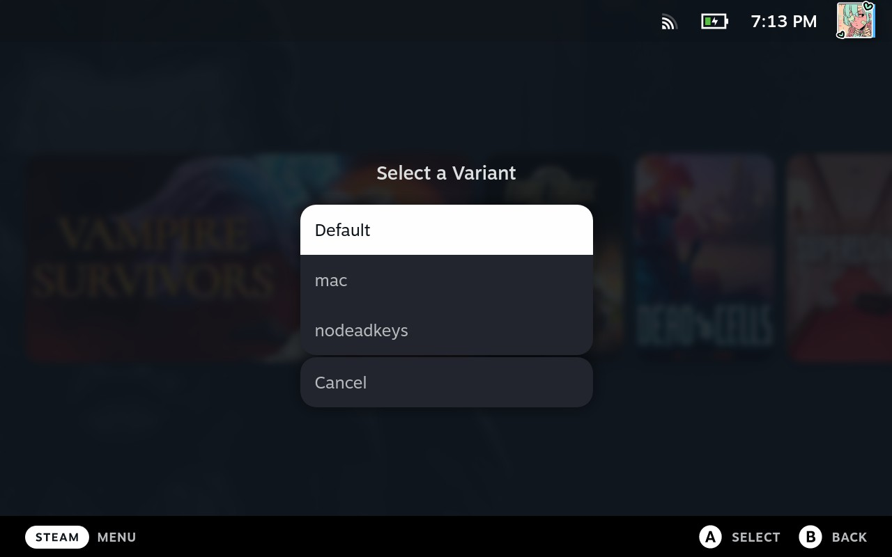
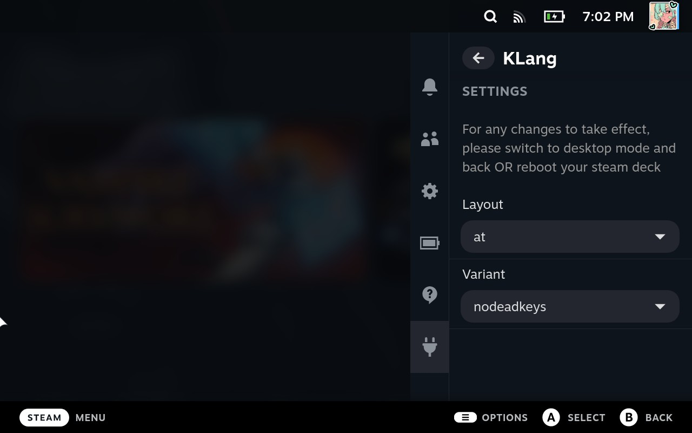

# KLang!

KLang! - **K**eyboard **L**ayout and V**a**riation Cha**ng**er is a plugin for [decky-loader](https://github.com/SteamDeckHomebrew/deckly-loader) which lets the user change layout and variant of external keyboards.

## Why does this exist?

The Steam Deck already has options for setting keyboard layouts, so why does this exist?

Unfortunately that option only applies to the on-screen keyboard and **not** external keyboards connected via bluetooth.

## How does this work?

Luckely a workaround has been found by the user "KS-HTK" on github. So all credits for the workaround goes to them. [See here](https://github.com/ValveSoftware/SteamOS/issues/798/)

Gamescope lacks the ability to change layouts for external keyboards, so by writing ``XKB_DEFAULT_LAYOUT=<layout>`` and ``XKB_DEFAULT_VARIANT=<variant>`` into ``/etc/environment``, are we able to bypass this problem.

``<layout>`` is retrieved by getting a list of available layouts via ``localectl list-x11-keymap-layouts``

``<variant>`` is retrieved by getting a list of available variants ``localectl list-x11-keymap-variants <layout>``

And that's exacly how this plugin works. Yes it's a bit boring and a dry read but I wanted to keep things as clear as possible.

## Screenshots

## Troubleshooting

### Help my Steam Deck wont boot anymore!!

Don't panic **your data is not lost**. So whats going on here, is that if any of the 2 variables ``XKB_DEFAULT_LAYOUT`` or ``XKB_DEFAULT_VARIANT`` are set to an invalid value the operating system is confused and refuses to load.

please refer to [this](https://www.reddit.com/r/SteamDeck/comments/yf6rsf/steam_deck_recovery_instructions_without/) or the instuctions below (they are the same) to recover your Steam deck:

1. Power off your Steam Deck.
2. Hold down ``power + QAM`` (three white dots button).
3. A menu should have opened, select the second option and wait for it to boot. You are now in a previous version of your steam deck's os.
4. Open the terminal and write ``mkdir ~/steamos_current``
5. Now mount the image that wont boot to that folder by typing ``sudo mount.steamos -o nohome,noboot /dev/nvme0n1 ~/steamos_current``
6. Navigate to ``~/steamos_current/etc/environment`` and remove ``XKBE_DEFAULT_LAYOUT`` and ``XKB_DEFAULT_VARIANT`` with their values from the file, save and close the file.
7. Reboot.

This should have fixed the stuck boot issue. If you experience any other problems please let me know by creating an issue in this repo. 
